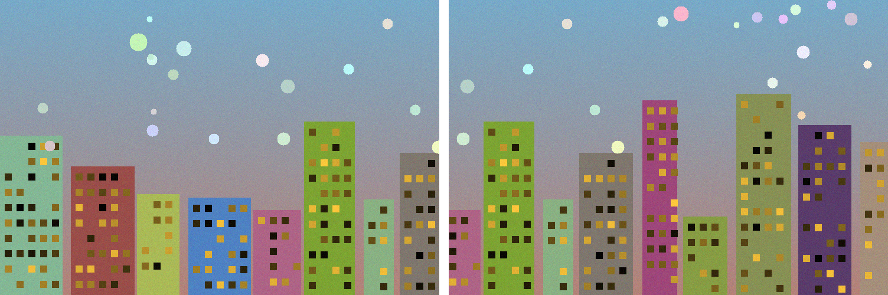
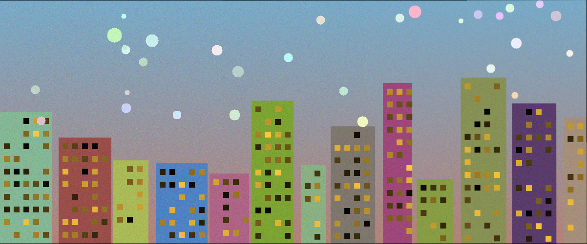

# panorama-stitcher

Blend a handful of overlapping photos into one seamless wide panorama: feature
matching → homography estimation → RANSAC → warp → feather blend. The homography
math (normalized DLT) and RANSAC are implemented from scratch in NumPy. OpenCV is
used for ORB features and fast warping when available, with a pure-NumPy fallback
(Harris corners + NCC matching + bilinear warping) when it is not.

- **Live page:** https://andreaisabelmontana.github.io/panorama-stitcher/

## The math

### Homography (DLT)

A homography `H` is a 3×3 matrix relating two views of the same plane up to scale:
for a source point `x = (x, y, 1)ᵀ` and its match `x' = (x', y', 1)ᵀ`,

```
x' ~ H x          (~ means equal up to a nonzero scale)
```

Taking the cross product `x' × (H x) = 0` linearises this into two equations per
correspondence in the 9 unknowns of `H`. Stacking `n ≥ 4` correspondences gives a
homogeneous system `A h = 0`. The least-squares solution with `‖h‖ = 1` is the
right singular vector of `A` with the smallest singular value — the last row of
`Vᵀ` from the SVD `A = U Σ Vᵀ`.

Raw pixel coordinates make `A` badly conditioned, so points are first
**Hartley-normalized** (translated to zero mean, scaled to mean distance `√2`),
solved, then denormalized: `H = T_dstⁱ Hₙ T_src`.

Implemented in `panorama/homography.py` (`estimate_homography`).

### RANSAC

Feature matches contain wrong pairs (outliers) that would wreck a plain
least-squares fit. RANSAC fits robustly:

1. sample 4 random correspondences (the minimal set for a homography),
2. fit a candidate `H` to them via the DLT,
3. count **inliers** — matches with reprojection error `< threshold` px,
4. keep the candidate with the most inliers,
5. finally **refit** `H` on all inliers of the best model.

The iteration count adapts to the observed inlier ratio `w`:
`N = log(1 − p) / log(1 − w⁴)` for target success probability `p`. Degenerate
(collinear/duplicate) minimal samples are skipped. Implemented in
`panorama/ransac.py` (`ransac_homography`).

## Pipeline

```
detect + match features  →  RANSAC homography  →  warp into a common canvas  →  feather blend
```

- `panorama/features.py` — ORB keypoints + Hamming brute-force + Lowe ratio test
  (OpenCV), or Harris corners + NCC patch matching (NumPy fallback).
- `panorama/homography.py` — normalized DLT, point application, reprojection error.
- `panorama/ransac.py` — robust homography with adaptive iteration count.
- `panorama/blend.py` — bounding-box canvas, perspective warp (OpenCV
  `warpPerspective` or NumPy bilinear inverse-map), distance-transform feather
  blending of the overlap.
- `stitch.py` — driver: loads images, stitches adjacent pairs, writes the panorama.

## Run it

```bash
pip install -r requirements.txt        # numpy + (optional) opencv-python + pytest

# bundled demo — generates synthetic samples if missing, writes output.png
python stitch.py

# your own photos (left-to-right, overlapping)
python stitch.py photo1.jpg photo2.jpg photo3.jpg -o panorama.png
```

If `opencv-python` will not install, everything still runs on the NumPy path
(slower, fewer matches, same math).

## Bundled demo + real numbers

`samples/make_samples.py` builds a 1200×500 textured skyline scene and splits it
into two overlapping 744×500 crops (`left.png`, `right.png`) — so the demo runs
with zero manual input. Running `python stitch.py` on them (OpenCV ORB backend):

| metric | value |
|---|---|
| feature matches | 554 |
| RANSAC inliers | 478 (86%) |
| mean inlier reprojection error | **0.265 px** |
| RANSAC iterations | 50 |
| output panorama | 1202 × 502 |

The reconstructed panorama is 1202×502 — within 2 px of the original 1200×500
scene the crops were cut from, confirming the recovered geometry is essentially
exact.

| before (two overlapping crops) | after (stitched panorama) |
|---|---|
|  |  |

## Tests

```bash
python -m pytest -q
```

The suite (`tests/`) is self-contained — it synthesizes correspondences under a
**known** random homography, injects gross outliers, and asserts that
RANSAC + DLT recover the true geometry and flag the outliers:

- `test_homography.py` — the 4 source points map exactly onto the destination
  points; a known homography is recovered from many points to ~1e-6.
- `test_ransac.py` — with 30–40% outliers, RANSAC recovers the known homography
  (geometric agreement < 2 px), catches ≥ 90% of true inliers, and admits **zero**
  outliers.
- `test_stitch.py` — an end-to-end split-image pair is aligned to the correct
  pixel shift and the overlap region agrees photometrically (mean abs diff < 5).

```
11 passed in 1.30s
```

## License

MIT — see `LICENSE`.
